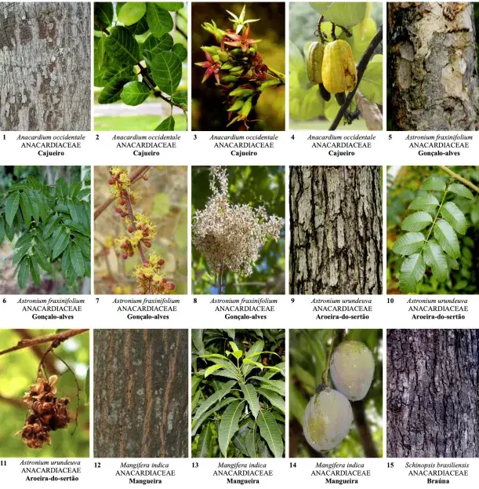
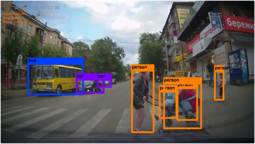
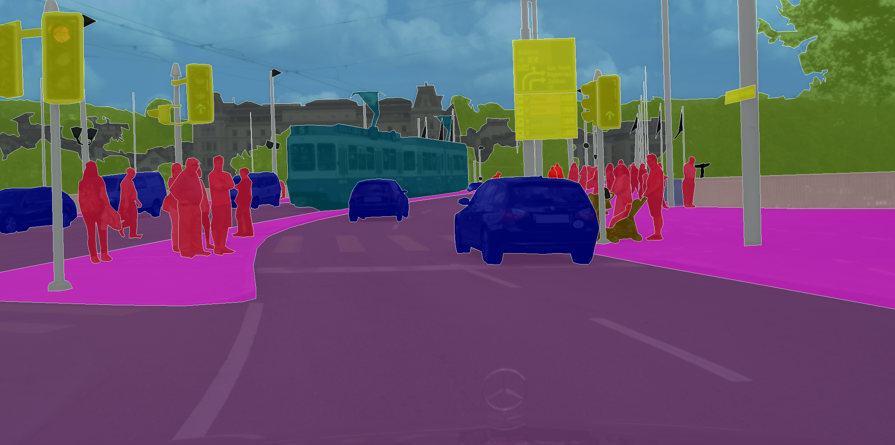
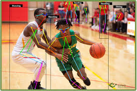
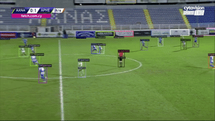
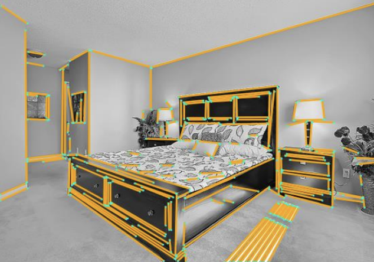
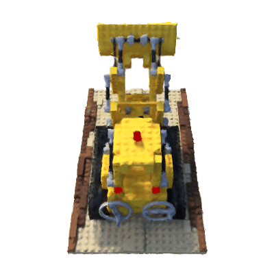
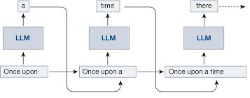
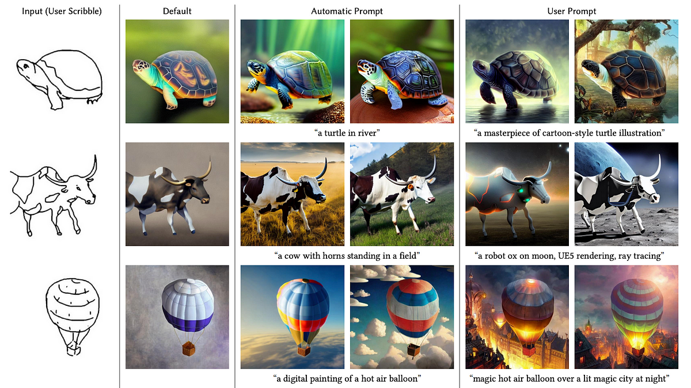

# CVlization: Curated AI Training and Inference Recipes That Just Work

A curated collection of 60+ state-of-the-art open source AI capabilities, packaged in self-contained Docker environments. Find a recipe, test it, copy what you need.

**Browse:** Vision (classification, detection, segmentation, OCR) • Language (LLMs, fine-tuning) • Multimodal (VLMs, document AI) • Generative (image, video)

*CVlization stands on the shoulders of giants - we package and test amazing open source projects so you can use them with confidence.*

## Quick Start

```bash
git clone --depth 1 https://github.com/kungfuai/CVlization
cd CVlization

# Install CLI (optional - or just use bash scripts)
pip install .

# Browse examples
cvl list --tag llm
# or browse examples/ on GitHub

# Run any example
bash examples/perception/image_classification/torch/build.sh
bash examples/perception/image_classification/torch/train.sh

# Copy into your project
cp -r examples/perception/image_classification/torch your-project/
```

That's it! Each example is self-contained with its own Dockerfile and dependencies. (We battled CUDA versions and dependency conflicts so you don't have to.)

## Table of Contents

- [Examples](#examples)
- [Browse Examples](#browse-examples)
- [Running an Example](#running-an-example)
- [Centralized Caching](#centralized-caching)
- [Requirements](#requirements)
- [For Contributors](#for-contributors)
- [CVlization Library](#cvlization-library)
- [Documentation](#documentation)
- [License](#licenses)

## Examples

Our `examples/` directory is organized by capability (what the model does) rather than modality (what data it processes). Each example is self-contained with its own Dockerfile and dependencies.

### Directory Structure

```
examples/
  analytical/          # Prediction on structured/unstructured data (future)
  perception/          # Understand signals (vision, speech, multimodal)
  generative/          # Create content (text, images, video, audio)
  agentic/             # Planning, tools, RAG, workflows (future)
```

### Catalog of Examples

#### 🔍 Perception (Understanding Signals)

| Capability | Example Directory | Implementations | Status |
|------------|-------------------|-----------------|--------|
|  Image Classification | [`examples/perception/image_classification`](./examples/perception/image_classification) | torch | ✅ |
|  Object Detection | [`examples/perception/object_detection`](./examples/perception/object_detection) | mmdet, torchvision | ✅ |
|  Segmentation | [`examples/perception/segmentation`](./examples/perception/segmentation) | instance (mmdet, sam, torchvision), semantic (mmseg, torchvision), panoptic (mmdet, torchvision) | ✅ |
|  Pose Estimation | [`examples/perception/pose_estimation`](./examples/perception/pose_estimation) | dwpose, mmpose | ✅ |
|  Tracking | [`examples/perception/tracking`](./examples/perception/tracking) | global_tracking_transformer, soccer_visual_tracking | ✅ |
|  Line Detection | [`examples/perception/line_detection`](./examples/perception/line_detection) | torch | ✅ |
|  OCR & Layout | [`examples/perception/ocr_and_layout`](./examples/perception/ocr_and_layout) | docling_serve, dots_ocr, nanonets_ocr, surya | ✅ |
|  Document AI (VLMs) | [`examples/perception/doc_ai`](./examples/perception/doc_ai) | donut (doc_classification, doc_parse), granite_docling (+ finetune) | ✅ |
|  Vision-Language Models | [`examples/perception/vision_language`](./examples/perception/vision_language) | moondream2 (+ finetune), moondream3 | ✅ |
|  3D Reconstruction | [`examples/perception/3d_reconstruction`](./examples/perception/3d_reconstruction) | nerf_tf | ✅ |

#### ✨ Generative (Creating Content)

| Capability | Example Directory | Implementations | Status |
|------------|-------------------|-----------------|--------|
|  LLMs (text generation) | [`examples/generative/llm`](./examples/generative/llm) | Small-scale pretraining (nanogpt, modded_nanogpt, nanomamba, nanochat), Fine-tuning (unsloth: gpt_oss, llama_3b, qwen_7b; trl_sft), Inference (mistral7b, mixtral8x7b) | ✅ |
|  Image Generation | [`examples/generative/image_generation`](./examples/generative/image_generation) | cfm, ddpm, diffuser_unconditional, dit, dreambooth, edm2, flux, mdt, pixart, stable_diffusion, uva_energy, vqgan | ✅ |
|  Video Generation | [`examples/generative/video_generation`](./examples/generative/video_generation) | animate_diff, animate_diff_cog, animate_x, cogvideox, deforum, framepack, kandinsky, mimic_motion, minisora, phantom, skyreals, svd_cog, svd_comfy, vace, vace_comfy, video_in_between, wan_comfy, wan2gp | ✅ |

✅ = Tested and maintained

Note: These examples are regularly updated and tested to ensure compatibility with the latest dependencies. Each example may contain one or more implementations using different frameworks or models. To start with, we recommend starting with the Image Classification example.

## Browse Examples

**Via GitHub:** Browse [perception/](./examples/perception/) or [generative/](./examples/generative/) directories

**Via CLI:** Install with `pip install .` then:

```bash
# Find examples by tag
cvl list --tag llm
cvl list --tag document-ai

# Train a small LLM on Shakespeare text
# (from Andrej Karpathy's nanoGPT: https://github.com/karpathy/nanoGPT)
cvl run nanogpt train --max_iters=1000 --batch_size=16

# Run document AI inference
# (IBM Granite-Docling: https://huggingface.co/ibm-granite/granite-docling-258M)
cvl run granite-docling predict -i input_pdf=@document.pdf
```

The `cvl` CLI is optional - you can always use bash scripts directly:
```bash
# These are equivalent:
bash examples/generative/llm/nanogpt/train.sh
cvl run nanogpt train
```

## Running an Example

Every example follows the same simple pattern:

```bash
cd examples/<category>/<example_name>
bash build.sh       # Build Docker image
bash train.sh       # Train the model
bash predict.sh     # Run inference
```

**Example: Train an image classifier on CIFAR-10**

```bash
cd examples/perception/image_classification/torch
bash build.sh
bash train.sh
```

For detailed instructions and available options, see the README.md in each example directory.

**License Note:** Each example may reference projects with different licenses. Check the license file in each example directory.

#### Design choices

- The Dockerfile does not include the source code of the example. Instead, its main purpose is to provide a clean environment for the task at hand. The source code is mounted into the container at run time. If you need the docker image to be self-contained, please edit the Dockerfile to copy the source code into the image.
- We try to pin the versions of the dependencies. However, some dependencies may not be pinned due to the fast pace of development in the field. If you find any issues, please submit a PR.

### Centralized Caching

All examples use `~/.cache/cvlization/` for models and datasets, avoiding re-downloads across examples:

```bash
docker run --shm-size 16G --gpus=all \
	-v $(pwd)/examples/<my example directory>:/workspace \
	-v ~/.cache/cvlization:/root/.cache \  # Centralized cache for models & datasets
    -e CUDA_VISIBLE_DEVICES='0' \
	<docker_image_name> \
	python predict.py <my arguments>
```

**Benefits:**
- Automatic caching for HuggingFace Hub, PyTorch, and custom downloads
- Managed by build scripts - no manual setup required
- Shared across all examples to save disk space and bandwidth

## Requirements

- Docker ([Install Docker](https://docs.docker.com/get-docker/))
- NVIDIA GPU (most examples require 16GB+ VRAM; A10 or better recommended)
- nvidia-docker for GPU access
  ```bash
  # Ubuntu
  sudo apt-get install -y nvidia-container-toolkit
  ```

## Use CVlization on Colab

No installation needed - run examples directly in Google Colab:
[Colab notebook: CIFAR-10 classification](https://colab.research.google.com/drive/1FkZcZnJC_z-PuFSYM91kU1-d63-LecMJ?usp=sharing)

## For Contributors

CVlization includes Claude Code skills for AI-assisted development and automated verification:

- **`verify-training-pipeline`** - Validates training examples are properly structured, build successfully, train without errors, and log appropriate metrics
- **`verify-inference-example`** - Validates inference examples build correctly and run inference successfully

These skills enable Claude to automatically verify examples end-to-end, helping maintain code quality across the repository.

**Contributing Guidelines:**
- See [CONTRIBUTING.md](./CONTRIBUTING.md) for standardization patterns and best practices
- All examples should follow the build/train/predict script pattern
- Use verification metadata in `example.yaml` to track testing status

## Project Structure

- `examples/`: Contains various computer vision and language processing examples
- `bin/`: Shell scripts for building, running, and testing
- `cvlization/`: The core library (legacy)
- `data/`: Sample datasets
- `doc/`: Project documentation
- `tests/`: Unit and integration tests

## CVlization Library

The `cvlization/` directory provides optional reusable components:

**Available:**
- Training pipeline abstractions (image classification, object detection, LLMs, diffusion)
- Dataset builders with caching (PyTorch, TensorFlow, HuggingFace)
- Model factories (Torchvision, MMDetection, MMSegmentation)
- Utilities (metrics, logging, download helpers)

**Installation:** `pip install -e .`

**Note:** Examples are self-contained and don't require the library. For production use, copying example code directly is often simpler than depending on the library package.

## Documentation

Detailed documentation can be found in the `doc/` directory:

- [Computer vision model training workflow and quality checks](./doc/Computer%20vision%20model%20training%20workflow%20and%20quality%20checks.pdf)
- [Multi-task multi-input models: a common pattern](./doc/Multi-task%20multi-input%20models_%20a%20common%20pattern.pdf)
- [Reusable model components](./doc/reusable_model_components.md)

## Licenses

We plan for the source and binary distribution of the `cvlization` module (installed via `pip`), and all source code and data under the `cvlization/` directory to be derived from software with permissive licenses and commercial friendly.

The source code in the `examples/` directory, however, may contain source code derived from software under copyleft and/or non-commercial licenses. Source code in `examples/` is not distributed when you install `cvlization`.
