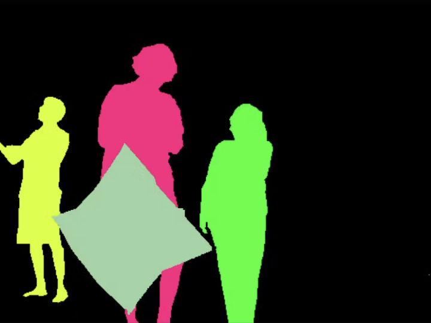
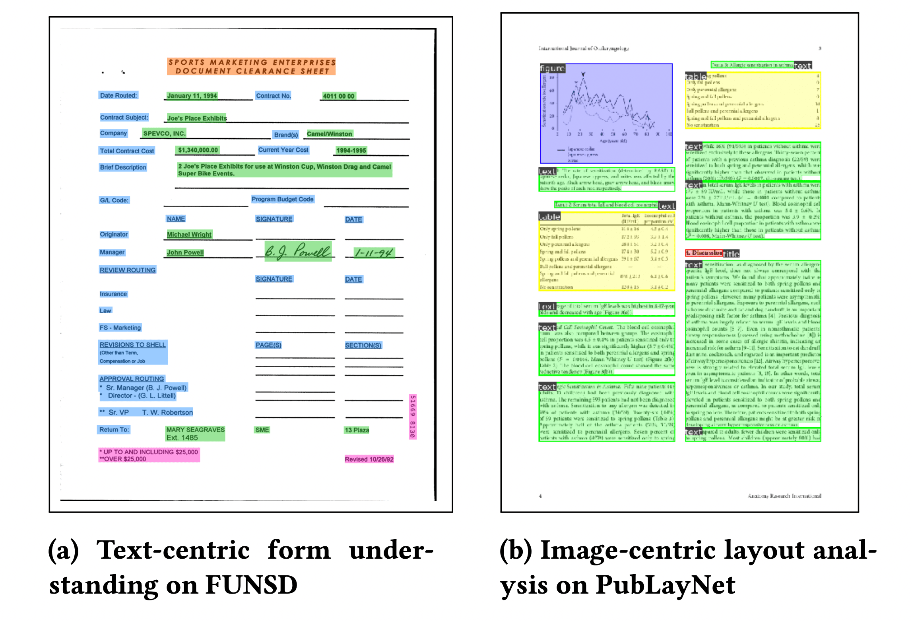
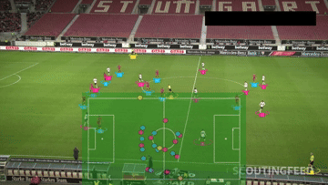

# CVlization: Practical and sample-efficient training pipelines for vision, language and more modalities

## Introduction

CVlization provides ready-to-use, dockerized workflows for various computer vision and language tasks. Each example has frozen dependencies, ensuring reproducibility and ease of use.

## Table of Contents

- [Examples](#examples)
- [Requirements](#requirements)
- [Quickstart](#quickstart)
- [Project Structure](#project-structure)
- [Library (Legacy)](#library-legacy)
- [Documentation](#documentation)
- [License](#licenses)

## Examples

Our `examples/` directory contains a variety of computer vision and language processing tasks. Each example is self-contained with its own Dockerfile and dependencies.


### Catalog of Examples

| Task Type | Workflow | Example Directory | Implementations | Status |
|-----------|----------|-------------------|-----------------|--------|
|  Image Classification | Training | [`examples/image_classification`](./examples/image_classification) | torch | ✅ |
|  Object Detection | Training | [`examples/object_detection`](./doc/object_detection) | mmdet, torchvision | ✅ |
|  Semantic Segmentation | Training | [`examples/semantic_segmentation`](./examples/semantic_segmentation) | mmseg, torchvision | ✅ |
|  Instance Segmentation | Training | [`examples/instance_segmentation`](./examples/instance_segmentation) | mmdet, sam, seem, torchvision | ✅ |
|  Panoptic Segmentation | Training | [`examples/panoptic_segmentation`](./examples/panoptic_segmentation) | mmdet, torchvision | ✅ |
|  Pose Estimation | Training | [`examples/pose_estimation`](./examples/pose_estimation) | mmpose | ✅ |
|  Object Tracking | Inference | [`examples/object_tracking`](./examples/object_tracking) | global tracking transformer | ✅ |
|  Line Detection | Training | [`examples/line_detection`](./examples/line_detection) | torch | ✅ |
|  Image Generation | Training, Inference | [`examples/image_gen`](./examples/image_gen) | diffuser_unconditional, dit, dreambooth, flux, mdt, pixart, stable_diffusion, uva_energy, vqgan | ✅ |
|  Text Generation | Training, Inference | [`examples/text_gen`](./examples/text_gen) | mistral7b, mixtral8x7b, nanogpt, nanomamba | ✅ |
|  Video Generation | Training, Inference | [`examples/video_gen`](./examples/video_gen) | animate_diff, cogvideox, deforum, minisora, svd_cog, svd_comfy, video_in_between | ✅ |
|  3D: rendering and reconstruction | Training | [`examples/nerf`](./examples/nerf) | tf | ✅ |
|  Document AI | Training | [`examples/doc_ai`](./examples/doc_ai) | doc_classification, doc_parse | ✅ |
|  Sports Analysis | Inference | [`examples/sports`](./examples/sports) | soccer_game_visual_tracking | ✅ |

✅ = Tested and maintained

Note: These examples are regularly updated and tested to ensure compatibility with the latest dependencies. Each example may contain one or more implementations using different frameworks or models. To start with, we recommend starting with the Image Classification example.

### Running an Example

To run an example:

1. Build the docker image:
```bash
bash examples/<example_directory>/build.sh
```
2. Run the following command to run the training workflow:
```bash
bash examples/<example_directory>/train.sh
```
3. If you want to run the inference workflow, run the following command:
```bash
bash examples/<example_directory>/predict.sh
```
or
```bash
bash examples/<example_directory>/generate.sh
```

4. For more information, see the README.md file in the example directory.

**License.** Each example typically references a project that has its own license. Please refer to the license file in the example sub-directory or the referenced project for more details.

#### Design choices

- The Dockerfile does not include the source code of the example. Instead, its main purpose is to provide a clean environment for the task at hand. The source code is mounted into the container at run time. If you need the docker image to be self-contained, please edit the Dockerfile to copy the source code into the image.
- We try to pin the versions of the dependencies. However, some dependencies may not be pinned due to the fast pace of development in the field. If you find any issues, please submit a PR.
- To avoid repeated downloading of datasets and model weights, we use `data/container_cache` to store the downloaded files and mount it to the container. For example, this is a typical `predict.sh`:
```bash
docker run --shm-size 16G --runtime nvidia -it \
	-v $(pwd)/examples/<my example directory>:/workspace \
	-v $(pwd)/data/container_cache:/root/.cache \  # this is where torch and huggingface cache the downloaded models and datasets
    -e CUDA_VISIBLE_DEVICES='0' \
	<docker_image_name> \
	python predict.py <my arguments>
```

## Requirements

- Docker
- NVIDIA GPU (for GPU-accelerated examples)

## Quickstart

### Use CVlization with Docker

Please follow the instructions above in the [Running an Example](#running-an-example) section.

For GPU support on Ubuntu, you may need to install `nvidia-container-toolkit`:
```
sudo apt-get install -y nvidia-container-toolkit
```

We can use the the image classification example to run an experiment on cifar10.

```bash
bash examples/image_classification/torch/build.sh
bash examples/image_classification/torch/train.sh
```

### Use CVlization on Colab
[Colab notebook: running experiments on cifar10](https://colab.research.google.com/drive/1FkZcZnJC_z-PuFSYM91kU1-d63-LecMJ?usp=sharing)

## Project Structure

- `examples/`: Contains various computer vision and language processing examples
- `bin/`: Shell scripts for building, running, and testing
- `cvlization/`: The core library (legacy)
- `data/`: Sample datasets
- `doc/`: Project documentation
- `tests/`: Unit and integration tests

## Library (Legacy)

The `cvlization` library in this repository was the initial focus but may not be actively maintained due to the rapidly changing landscape of dependencies. Users are encouraged to refer to the `examples/` for up-to-date, working implementations.

## Documentation

Detailed documentation can be found in the `doc/` directory:

- [Computer vision model training workflow and quality checks](./doc/Computer%20vision%20model%20training%20workflow%20and%20quality%20checks.pdf)
- [Multi-task multi-input models: a common pattern](./doc/Multi-task%20multi-input%20models_%20a%20common%20pattern.pdf)
- [Reusable model components](./doc/reusable_model_components.md)

## Licenses

We plan for the source and binary distribution of the `cvlization` module (installed via `pip`), and all source code and data under the `cvlization/` directory to be derived from software with permissive licenses and commercial friendly.

The source code in the `examples/` directory, however, may contain source code derived from software under copyleft and/or non-commercial licenses. Source code in `examples/` is not distributed when you install `cvlization`.
