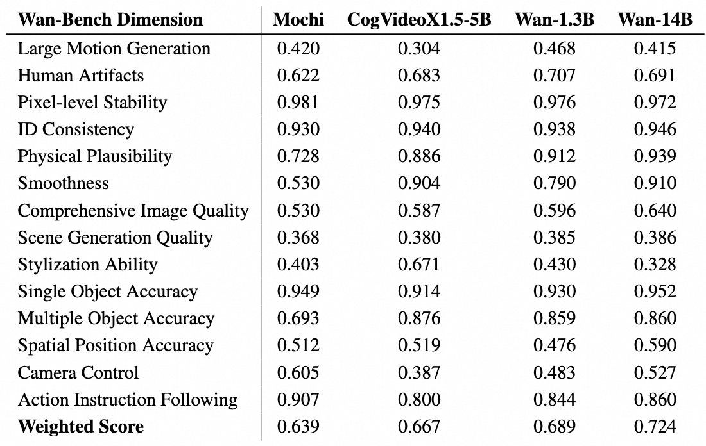
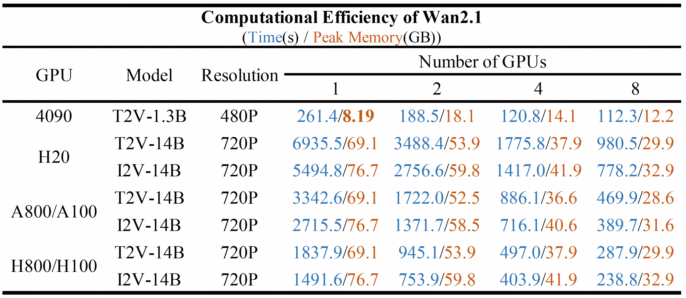
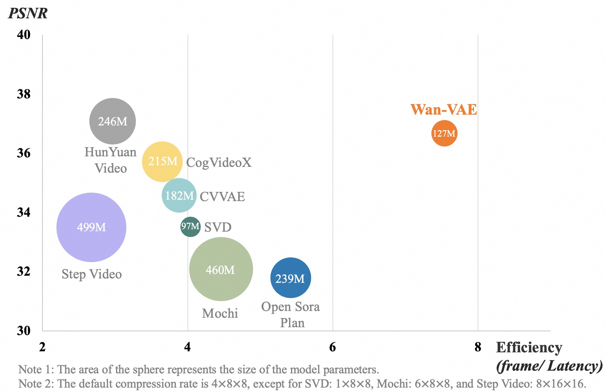
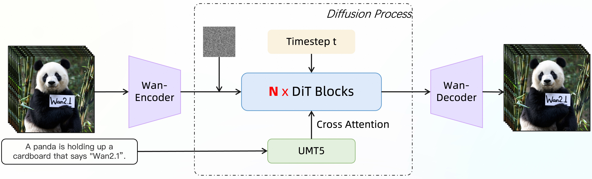
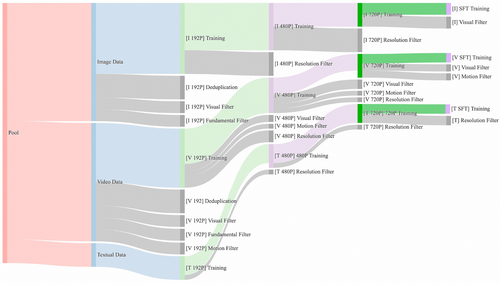
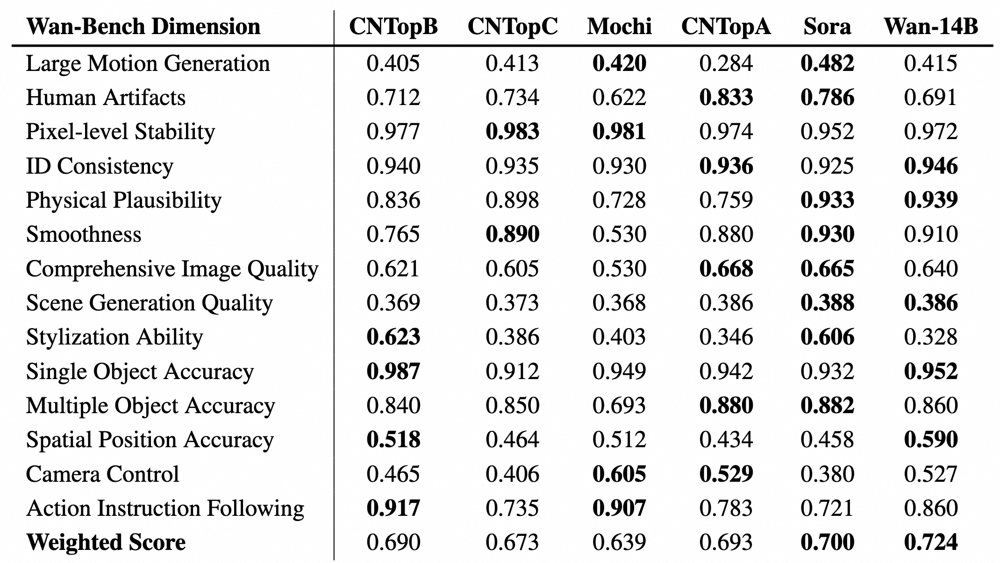

# Wan2.1

<p align="center">
    
<p>

<p align="center">
    💜 <a href=""><b>Wan</b></a> &nbsp&nbsp ｜ &nbsp&nbsp 🖥️ <a href="https://github.com/Wan-Video/Wan2.1">GitHub</a> &nbsp&nbsp  | &nbsp&nbsp🤗 <a href="https://huggingface.co/Wan-AI/">Hugging Face</a>&nbsp&nbsp | &nbsp&nbsp🤖 <a href="https://modelscope.cn/organization/Wan-AI">ModelScope</a>&nbsp&nbsp | &nbsp&nbsp 📑 <a href="">Paper (Coming soon)</a> &nbsp&nbsp | &nbsp&nbsp 📑 <a href="https://wanxai.com">Blog</a> &nbsp&nbsp | &nbsp&nbsp💬 <a href="https://gw.alicdn.com/imgextra/i2/O1CN01tqjWFi1ByuyehkTSB_!!6000000000015-0-tps-611-1279.jpg">WeChat Group</a>&nbsp&nbsp | &nbsp&nbsp 📖 <a href="https://discord.gg/p5XbdQV7">Discord</a>&nbsp&nbsp
<br>

-----

[**Wan: Open and Advanced Large-Scale Video Generative Models**]("#") <be>

In this repository, we present **Wan2.1**, a comprehensive and open suite of video foundation models that pushes the boundaries of video generation. **Wan2.1** offers these key features:
- 👍 **SOTA Performance**: **Wan2.1** consistently outperforms existing open-source models and state-of-the-art commercial solutions across multiple benchmarks.
- 👍 **Supports Consumer-grade GPUs**: The T2V-1.3B model requires only 8.19 GB VRAM, making it compatible with almost all consumer-grade GPUs. It can generate a 5-second 480P video on an RTX 4090 in about 4 minutes (without optimization techniques like quantization). Its performance is even comparable to some closed-source models.
- 👍 **Multiple Tasks**: **Wan2.1** excels in Text-to-Video, Image-to-Video, Video Editing, Text-to-Image, and Video-to-Audio, advancing the field of video generation.
- 👍 **Visual Text Generation**: **Wan2.1** is the first video model capable of generating both Chinese and English text, featuring robust text generation that enhances its practical applications.
- 👍 **Powerful Video VAE**: **Wan-VAE** delivers exceptional efficiency and performance, encoding and decoding 1080P videos of any length while preserving temporal information, making it an ideal foundation for video and image generation.


This repository hosts our T2V-1.3B model, a versatile solution for video generation that is compatible with nearly all consumer-grade GPUs. In this way, we hope that **Wan2.1** can serve as an easy-to-use tool for more creative teams in video creation, providing a high-quality foundational model for academic teams with limited computing resources. This will facilitate both the rapid development of the video creation community and the swift advancement of video technology.


## Video Demos

<div align="center">
    <video width="80%" controls>
        <source src="https://cloud.video.taobao.com/vod/Jth64Y7wNoPcJki_Bo1ZJTDBvNjsgjlVKsNs05Fqfps.mp4" type="video/mp4">
        Your browser does not support the video tag.
    </video>
</div>


## 🔥 Latest News!!

* Feb 25, 2025: 👋 We've released the inference code and weights of Wan2.1.


## 📑 Todo List
- Wan2.1 Text-to-Video
    - [x] Multi-GPU Inference code of the 14B and 1.3B models
    - [x] Checkpoints of the 14B and 1.3B models
    - [x] Gradio demo
    - [x] Diffusers integration
    - [ ] ComfyUI integration
- Wan2.1 Image-to-Video
    - [x] Multi-GPU Inference code of the 14B model
    - [x] Checkpoints of the 14B model
    - [x] Gradio demo
    - [x] Diffusers integration
    - [ ] ComfyUI integration


## Quickstart

#### Installation
Clone the repo:
```
git clone https://github.com/Wan-Video/Wan2.1.git
cd Wan2.1
```

Install dependencies:
```
# Ensure torch >= 2.4.0
pip install -r requirements.txt
```


#### Model Download

| Models        |                       Download Link                                           |    Notes                      |
| --------------|-------------------------------------------------------------------------------|-------------------------------|
| T2V-14B       |      🤗 [Huggingface](https://huggingface.co/Wan-AI/Wan2.1-T2V-14B)      🤖 [ModelScope](https://www.modelscope.cn/models/Wan-AI/Wan2.1-T2V-14B)          | Supports both 480P and 720P
| I2V-14B-720P  |      🤗 [Huggingface](https://huggingface.co/Wan-AI/Wan2.1-I2V-14B-720P)    🤖 [ModelScope](https://www.modelscope.cn/models/Wan-AI/Wan2.1-I2V-14B-720P)     | Supports 720P
| I2V-14B-480P  |      🤗 [Huggingface](https://huggingface.co/Wan-AI/Wan2.1-I2V-14B-480P)    🤖 [ModelScope](https://www.modelscope.cn/models/Wan-AI/Wan2.1-I2V-14B-480P)      | Supports 480P
| T2V-1.3B      |      🤗 [Huggingface](https://huggingface.co/Wan-AI/Wan2.1-T2V-1.3B)     🤖 [ModelScope](https://www.modelscope.cn/models/Wan-AI/Wan2.1-T2V-1.3B)         | Supports 480P


> 💡Note: The 1.3B model is capable of generating videos at 720P resolution. However, due to limited training at this resolution, the results are generally less stable compared to 480P. For optimal performance, we recommend using 480P resolution.


Download models using 🤗 huggingface-cli:
```
pip install "huggingface_hub[cli]"
huggingface-cli download Wan-AI/Wan2.1-T2V-1.3B-Diffusers --local-dir ./Wan2.1-T2V-1.3B-Diffusers
```

Download models using 🤖 modelscope-cli:
```
pip install modelscope
modelscope download Wan-AI/Wan2.1-T2V-1.3B-Diffusers --local_dir ./Wan2.1-T2V-1.3B-Diffusers
```

#### Run Text-to-Video Generation

This repository supports two Text-to-Video models (1.3B and 14B) and two resolutions (480P and 720P). The parameters and configurations for these models are as follows:

<table>
    <thead>
        <tr>
            <th rowspan="2">Task</th>
            <th colspan="2">Resolution</th>
            <th rowspan="2">Model</th>
        </tr>
        <tr>
            <th>480P</th>
            <th>720P</th>
        </tr>
    </thead>
    <tbody>
        <tr>
            <td>t2v-14B</td>
            <td style="color: green;">✔️</td>
            <td style="color: green;">✔️</td>
            <td>Wan2.1-T2V-14B</td>
        </tr>
        <tr>
            <td>t2v-1.3B</td>
            <td style="color: green;">✔️</td>
            <td style="color: red;">❌</td>
            <td>Wan2.1-T2V-1.3B</td>
        </tr>
    </tbody>
</table>


##### (1) Without Prompt Extention

To facilitate implementation, we will start with a basic version of the inference process that skips the [prompt extension](#2-using-prompt-extention) step.

- Single-GPU inference

```
python generate.py  --task t2v-1.3B --size 832*480 --ckpt_dir ./Wan2.1-T2V-1.3B --sample_shift 8 --sample_guide_scale 6 --prompt "Two anthropomorphic cats in comfy boxing gear and bright gloves fight intensely on a spotlighted stage."
```

If you encounter OOM (Out-of-Memory) issues, you can use the `--offload_model True` and `--t5_cpu` options to reduce GPU memory usage. For example, on an RTX 4090 GPU:

```
python generate.py  --task t2v-1.3B --size 832*480 --ckpt_dir ./Wan2.1-T2V-1.3B --offload_model True --t5_cpu --sample_shift 8 --sample_guide_scale 6 --prompt "Two anthropomorphic cats in comfy boxing gear and bright gloves fight intensely on a spotlighted stage."
```

> 💡Note: If you are using the `T2V-1.3B` model, we recommend setting the parameter `--sample_guide_scale 6`. The `--sample_shift parameter` can be adjusted within the range of 8 to 12 based on the performance.

- Multi-GPU inference using FSDP + xDiT USP

```
pip install "xfuser>=0.4.1"
torchrun --nproc_per_node=8 generate.py --task t2v-1.3B --size 832*480 --ckpt_dir ./Wan2.1-T2V-1.3B --dit_fsdp --t5_fsdp --ulysses_size 8 --sample_shift 8 --sample_guide_scale 6 --prompt "Two anthropomorphic cats in comfy boxing gear and bright gloves fight intensely on a spotlighted stage."
```

Wan can also be run directly using 🤗 Diffusers!

```python
import torch
from diffusers import AutoencoderKLWan, WanPipeline
from diffusers.utils import export_to_video

# Available models: Wan-AI/Wan2.1-T2V-14B-Diffusers, Wan-AI/Wan2.1-T2V-1.3B-Diffusers
model_id = "Wan-AI/Wan2.1-T2V-1.3B-Diffusers"
vae = AutoencoderKLWan.from_pretrained(model_id, subfolder="vae", torch_dtype=torch.float32)
pipe = WanPipeline.from_pretrained(model_id, vae=vae, torch_dtype=torch.bfloat16)
pipe.to("cuda")

prompt = "A cat walks on the grass, realistic"
negative_prompt = "Bright tones, overexposed, static, blurred details, subtitles, style, works, paintings, images, static, overall gray, worst quality, low quality, JPEG compression residue, ugly, incomplete, extra fingers, poorly drawn hands, poorly drawn faces, deformed, disfigured, misshapen limbs, fused fingers, still picture, messy background, three legs, many people in the background, walking backwards"

output = pipe(
    prompt=prompt,
    negative_prompt=negative_prompt,
    height=480,
    width=832,
    num_frames=81,
    guidance_scale=5.0
).frames[0]
export_to_video(output, "output.mp4", fps=15)
```

##### (2) Using Prompt Extention

Extending the prompts can effectively enrich the details in the generated videos, further enhancing the video quality. Therefore, we recommend enabling prompt extension. We provide the following two methods for prompt extension:

- Use the Dashscope API for extension.
  - Apply for a `dashscope.api_key` in advance ([EN](https://www.alibabacloud.com/help/en/model-studio/getting-started/first-api-call-to-qwen) | [CN](https://help.aliyun.com/zh/model-studio/getting-started/first-api-call-to-qwen)).
  - Configure the environment variable `DASH_API_KEY` to specify the Dashscope API key. For users of Alibaba Cloud's international site, you also need to set the environment variable `DASH_API_URL` to 'https://dashscope-intl.aliyuncs.com/api/v1'. For more detailed instructions, please refer to the [dashscope document](https://www.alibabacloud.com/help/en/model-studio/developer-reference/use-qwen-by-calling-api?spm=a2c63.p38356.0.i1).
  - Use the `qwen-plus` model for text-to-video tasks and `qwen-vl-max` for image-to-video tasks.
  - You can modify the model used for extension with the parameter `--prompt_extend_model`. For example:
```
DASH_API_KEY=your_key python generate.py  --task t2v-1.3B --size 832*480 --ckpt_dir ./Wan2.1-T2V-1.3B --prompt "Two anthropomorphic cats in comfy boxing gear and bright gloves fight intensely on a spotlighted stage" --use_prompt_extend --prompt_extend_method 'dashscope' --prompt_extend_target_lang 'ch'
```

- Using a local model for extension.

  - By default, the Qwen model on HuggingFace is used for this extension. Users can choose based on the available GPU memory size.
  - For text-to-video tasks, you can use models like `Qwen/Qwen2.5-14B-Instruct`, `Qwen/Qwen2.5-7B-Instruct` and `Qwen/Qwen2.5-3B-Instruct`
  - For image-to-video tasks, you can use models like `Qwen/Qwen2.5-VL-7B-Instruct` and `Qwen/Qwen2.5-VL-3B-Instruct`.
  - Larger models generally provide better extension results but require more GPU memory.
  - You can modify the model used for extension with the parameter `--prompt_extend_model` , allowing you to specify either a local model path or a Hugging Face model. For example:

```
python generate.py  --task t2v-1.3B --size 832*480 --ckpt_dir ./Wan2.1-T2V-1.3B --prompt "Two anthropomorphic cats in comfy boxing gear and bright gloves fight intensely on a spotlighted stage" --use_prompt_extend --prompt_extend_method 'local_qwen' --prompt_extend_target_lang 'ch'
```

##### (3) Runing local gradio

```
cd gradio
# if one uses dashscope’s API for prompt extension
DASH_API_KEY=your_key python t2v_1.3B_singleGPU.py --prompt_extend_method 'dashscope' --ckpt_dir ./Wan2.1-T2V-1.3B

# if one uses a local model for prompt extension
python t2v_1.3B_singleGPU.py --prompt_extend_method 'local_qwen' --ckpt_dir ./Wan2.1-T2V-1.3B
```


## Evaluation

We employ our **Wan-Bench** framework to evaluate the performance of the T2V-1.3B model, with the results displayed in the table below. The results indicate that our smaller 1.3B model surpasses the overall metrics of larger open-source models, demonstrating the effectiveness of **WanX2.1**'s architecture and the data construction pipeline.

<div align="center">
    
</div>


## Computational Efficiency on Different GPUs

We test the computational efficiency of different **Wan2.1** models on different GPUs in the following table. The results are presented in the format: **Total time (s) / peak GPU memory (GB)**.


<div align="center">
    
</div>

> The parameter settings for the tests presented in this table are as follows:
> (1) For the 1.3B model on 8 GPUs, set `--ring_size 8` and `--ulysses_size 1`;
> (2) For the 14B model on 1 GPU, use `--offload_model True`;
> (3) For the 1.3B model on a single 4090 GPU, set `--offload_model True --t5_cpu`;
> (4) For all testings, no prompt extension was applied, meaning `--use_prompt_extend` was not enabled.

-------

## Introduction of Wan2.1

**Wan2.1**  is designed on the mainstream diffusion transformer paradigm, achieving significant advancements in generative capabilities through a series of innovations. These include our novel spatio-temporal variational autoencoder (VAE), scalable training strategies, large-scale data construction, and automated evaluation metrics. Collectively, these contributions enhance the model’s performance and versatility.


##### (1) 3D Variational Autoencoders
We propose a novel 3D causal VAE architecture, termed **Wan-VAE** specifically designed for video generation. By combining multiple strategies, we improve spatio-temporal compression, reduce memory usage, and ensure temporal causality. **Wan-VAE** demonstrates significant advantages in performance efficiency compared to other open-source VAEs. Furthermore, our **Wan-VAE** can encode and decode unlimited-length 1080P videos without losing historical temporal information, making it particularly well-suited for video generation tasks.


<div align="center">
    
</div>


##### (2) Video Diffusion DiT

**Wan2.1** is designed using the Flow Matching framework within the paradigm of mainstream Diffusion Transformers. Our model's architecture uses the T5 Encoder to encode multilingual text input, with cross-attention in each transformer block embedding the text into the model structure. Additionally, we employ an MLP with a Linear layer and a SiLU layer to process the input time embeddings and predict six modulation parameters individually. This MLP is shared across all transformer blocks, with each block learning a distinct set of biases. Our experimental findings reveal a significant performance improvement with this approach at the same parameter scale.

<div align="center">
    
</div>


| Model  | Dimension | Input Dimension | Output Dimension | Feedforward Dimension | Frequency Dimension | Number of Heads | Number of Layers |
|--------|-----------|-----------------|------------------|-----------------------|---------------------|-----------------|------------------|
| 1.3B   | 1536      | 16              | 16               | 8960                  | 256                 | 12              | 30               |
| 14B   | 5120       | 16              | 16               | 13824                 | 256                 | 40              | 40               |


##### Data

We curated and deduplicated a candidate dataset comprising a vast amount of image and video data. During the data curation process, we designed a four-step data cleaning process, focusing on fundamental dimensions, visual quality and motion quality. Through the robust data processing pipeline, we can easily obtain high-quality, diverse, and large-scale training sets of images and videos.




##### Comparisons to SOTA
We compared **Wan2.1** with leading open-source and closed-source models to evaluate the performace. Using our carefully designed set of 1,035 internal prompts, we tested across 14 major dimensions and 26 sub-dimensions. Then we calculated the total score through a weighted average based on the importance of each dimension. The detailed results are shown in the table below. These results demonstrate our model's superior performance compared to both open-source and closed-source models.




## Citation
If you find our work helpful, please cite us.

```
@article{wan2.1,
    title   = {Wan: Open and Advanced Large-Scale Video Generative Models},
    author  = {Wan Team},
    journal = {},
    year    = {2025}
}
```

## License Agreement
The models in this repository are licensed under the Apache 2.0 License. We claim no rights over the your generate contents, granting you the freedom to use them while ensuring that your usage complies with the provisions of this license. You are fully accountable for your use of the models, which must not involve sharing any content that violates applicable laws, causes harm to individuals or groups, disseminates personal information intended for harm, spreads misinformation, or targets vulnerable populations. For a complete list of restrictions and details regarding your rights, please refer to the full text of the [license](LICENSE.txt).


## Acknowledgements

We would like to thank the contributors to the [SD3](https://huggingface.co/stabilityai/stable-diffusion-3-medium), [Qwen](https://huggingface.co/Qwen), [umt5-xxl](https://huggingface.co/google/umt5-xxl), [diffusers](https://github.com/huggingface/diffusers) and [HuggingFace](https://huggingface.co) repositories, for their open research.


## Contact Us
If you would like to leave a message to our research or product teams, feel free to join our [Discord](https://discord.gg/p5XbdQV7) or [WeChat groups](https://gw.alicdn.com/imgextra/i2/O1CN01tqjWFi1ByuyehkTSB_!!6000000000015-0-tps-611-1279.jpg)!